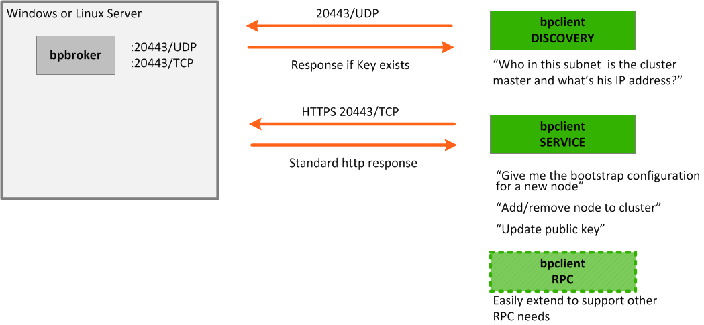

# CenturyLink Cloud Blueprint Broker Toolset

This repository contains a cross-platform toolset to decrease the complexity of deploying Blueprints within the **[CenturyLink Cloud](http://www.centurylinkcloud.com)** platform (though it can be easily leveraged across any other provider or platform).  Plug-in to these tools to gain instant multi-platform access to:
* Self-discoverable service broker - clients instantly find it without any hostname or IP address coding
* Encrypted key/value store with transparent authentication - for example use to facilitate bootstrapping a multi-server cluster or hot-adding additional nodes) to extend for file transfer and to facilitate server operations on demand
* Send richly formatted emails customized based on script-provided variables - increase customer success by notifying users how to access and interact with the instance of your software they just installed



## Contents

* [Installing](#installing)
* Tools
  * [bpbroker](README_bpbroker.md) tool with native service broker capabilities for state management that's easily extendable to decrease Blueprint complexity
  * [bpclient](README_bpclient.md) client-side tool that interacts with server-side bpbroker
  * [bpmailer](README_bpmailer.md) client-side tool to facilitate rich email with successful transactional delivery routing
* Drop-in use cases
  * [Easily send an email](examples/use_cases_send_email.md) (e.g. cross-platform and use a trusted SMTP relay)
  * [Find cluster master IP](examples/use_cases_find_master_ip.md) (e.g. find IP address where a specific service is running)
  * [Register a new client node into my software](examples/use_cases_register_client.md) (e.g. execute custom RPC)


## Installing
This toolset is developed to be natively cross-platform with no unreferenced dependencies.  Interactive installation options are available via pip but in reality this is packaged to support a drop-in scripted installation.

### Via CenturyLink Cloud package
bpbroker is available for Linux and Windows on the CenturyLink Cloud platform via a script package.  Execute the script directly on an existing server or add it to a new Blueprint.
These packages are public and their source is available via [this github repo](../Public Blueprint Source/BP Broker/).


### Linux Quickstart
The installation script is available inside [this github repo](../Public Blueprint Source/BP Broker/Linux/install_bpbroker.sh).  It can be installed via the following one-liner:
```shell
> curl https://raw.githubusercontent.com/CenturyLinkCloud/Ecosystem/master/Blueprints/Public%20Blueprint%20Source/BP%20Broker/Linux/install_bpbroker.sh | bash
```

### Windows Quickstart
The current Windows scripts to not download pre-reqs but instead bundle them in. The installation script and its dependencies are available inside [this github repo](../Public Blueprint Source/BP Broker/Windows) but we recommend leveraging the [zipped package](https://raw.githubusercontent.com/CenturyLinkCloud/Ecosystem/master/Blueprints/Public Blueprint Source/BP Broker/Blueprints_Completed_Packages/Windows_bpbroker.zip).

Binaries are available to execute rooted out of `%programfiles%\bpbroker\bin\`.


### Via Python's pip
Cross-platform installation is available via pypi.  Requires **Python 2.7** - this is not currently compatible with Python 3.
If you have pip already installed the following command will get you running.  Other tools built to interact with bpbroker
often expect it to be rooted in `/usr/local/bpbroker` (Linux) or `%programfiles%\bpbroker` (Windows).

```shell
# system-wide installation
> pip install bpbroker

# virtualenv installation (Linux)
> pip install virtualenv
> virtualenv /usr/local/bpbroker
> source /usr/local/bpbroker/bin/activate
> pip install bpbroker
```

This should automatically install the following dependencies used by the CLI: argparse,requests, premailer

If you do not have pip (the Python package manager) installed a quickstart install of this prereq on Linux/Mac is:
```shell
> curl https://bootstrap.pypa.io/get-pip.py | sudo python
```


