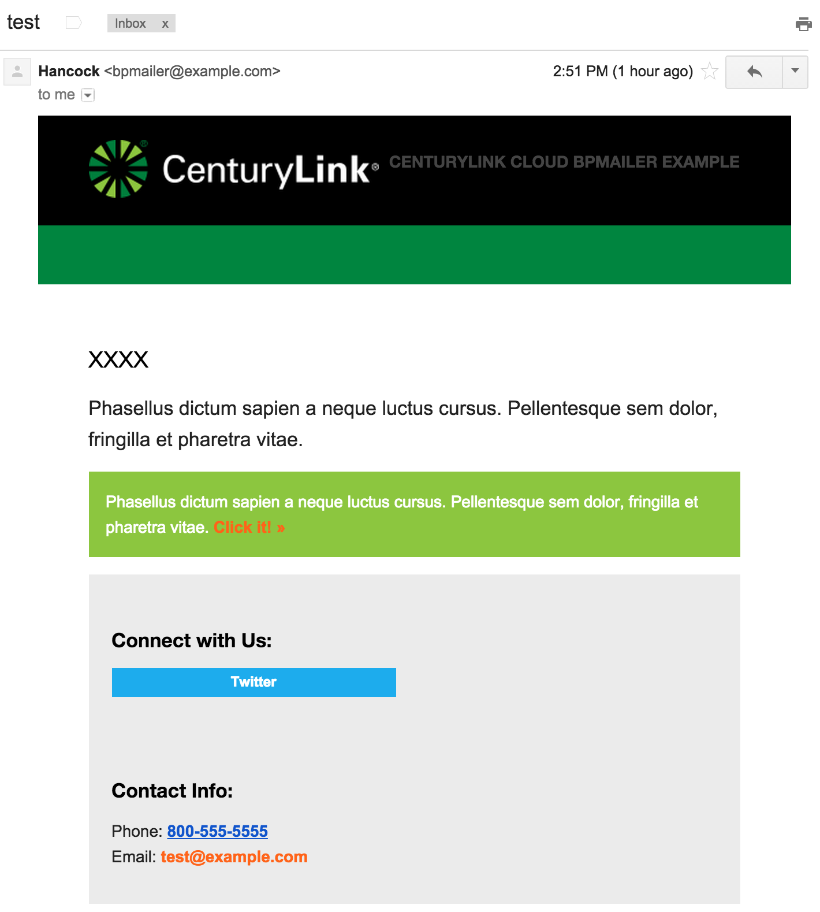

# bpmailer

The bpmailer tool, part of the [bpbroker](README.md) suite, facilitates easily adding emailing customers and support personnel as part of an application installation.
As with all items in the bpbroker toolset, this is cross-platform and designed as a drop-in tool to decrease the complexity of deployments by providing a standard set of
success oriented tools.

# Contents
* [Installing](#installing)
* [Usage](#usage)
* [Configuration](#configuration)
* [Variable Substitution](#variable-substitution)
* [Quickstart Example](#quickstart-example)

# Installing
See [bpbroker installation](README.md#installing).


# Usage
```shell
> bpmailer
usage: bpmailer [-h] --config CONFIG --to TO_ADDR --subject SUBJECT
                --template TEMPLATE [--from FROM_ADDR] [--css CSS]
                [--variables VARIABLES]

> bpmailer --help
usage: bpmailer.py [-h] --config CONFIG --to TO_ADDR --subject SUBJECT
                   --template TEMPLATE [--from FROM_ADDR] [--css CSS]
                   [--variables VARIABLES]

bpmailer tool

optional arguments:
  -h, --help            show this help message and exit
  --config CONFIG, -c CONFIG
                        Path to non-default configuration file
  --to TO_ADDR          Destination email address
  --subject SUBJECT     Email subject
  --template TEMPLATE   Path to mail template file
  --from FROM_ADDR      Source email address
  --css CSS             Path to optional css files not referenced in template
  --variables VARIABLES
                        Path to optional key=value variables files or '-' for
                        stdin.
```


# Configuration
Configuration can be made through any combination of the following methods in increasing order of priority.
* Hardcoded defaults
* json configuration file
* Environment variables
* Command line options

## Hardcoded Defaults
The following defaults are embedded within the tool:
```json
{
    "_bpmailer":  {
		"mail_from_address": "bpmailer@`hostname`",
        "smptp_server": "127.0.0.1",
        "smtp_port": 25,
        "smtp_user": "",
        "smtp_password": ""
    }
}
```

## Configuration File
This format is compatible with the bpbroker configuration file and both tools can use the same configuration.
See [Example bpmailer_config.json](examples/bpmailer_example_config.json) also shown below:
```json
{
	"_bpmailer":  {
		"mail_from_address": "test@example.com",
		"mail_cc_addresses": ["cc1@example.com","cc2@example.com"],

		"smtp_server": "127.0.0.1",
		"smtp_port": 25,
		"smtp_user": "",
		"smtp_password": ""
	}
}
```

## Available environment variables
The following environment variables are interpreted:
* MAIL_FROM_ADDRESS
* MAIL_CC_ADDRESSES
* SMTP_SERVER
* SMTP_PORT
* SMTP_USER
* SMTP_PASSWORD
* MAIL_FROM_ADDRESS

# Variable Substitution
Key/Value pairs passed into the bpmailer tool are substituted for variable placeholders within the html message file to support content customization.

Variable input via either stdin (specified as `-`) or a file specified in the `--variables` parameter.

Variables formated as key/value pairs with a newline seperating each.  A single value can span multiple lines but  the next variable must start
on a new line.  For example:

```shell
# correct
foo=bar

# correct
foo=bar
foo2=bar2
extra line

# incorrect
foo=barr foo2=bar2
```

# Quickstart Example
Example execution by passing variables through stdin on Linux using a HERE document.  Variables can be read via a file or specify `-` for stdin (as shown below).
```shell
> bpmailer --config bpmailer.json  --to toaddr@example.com --subject "Test Message" \
           --template examples/bpmailer_example_message_template \
           --css examples/bpmailer_example_css --from "John Smith <john@example.com>" --variables - <<HERE
NAME=xxxx
foo=bar
HERE
```

Results in the following email:



Starting from the email message and css inside the [examples](examples) directory will deliver a good multi-client experience.  This template is based on the
[ZURB](http://zurb.com/playground/responsive-email-templates) responsive email templates.  bpmailer includes a css inliner to easy flexibility and decrease time
to implement.

# Using bpmailer inside your CenturyLink Cloud Blueprints
Assume the following scenario

> You are an ISV distributing a new database engine.  You have developed a CenturyLink Cloud Blueprint package and a demo application so potential
> customers can easily test your application.  
>
> Your application takes a few minutes to populate with data which means an "application ready state" and the initial automated installation
> occur asynchronously.  To make using this demo application as easy as possible you want to tell the customer how to access it (the IP address
> and any initial credentials) and provide some example test queries.  To increase conversion rate you want to send this tailored message exactly
> when the application is ready to test.

Include a bpmailer configuration file with your installation package that points towards your SMTP relay:
```json
{
	"_bpmailer":  {
		"smtp_server": "relay.t3mx.com",
		"smtp_user": "username",
		"smtp_password": "password"
	}
}
```

After the data load is complete append the following lines to the end of your bash installation script:
```shell
> echo IP_ADDRESS=192.168.1.1 | bpmailer --config isv_custom.json  --to prospect@example.com \
                                         --subject "Database Ready for Testing" \
                                         --template isv_message_template \
										 --from "ISV Inc <john@example.com>" --variables - 
```


